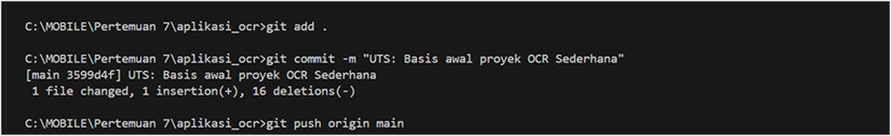
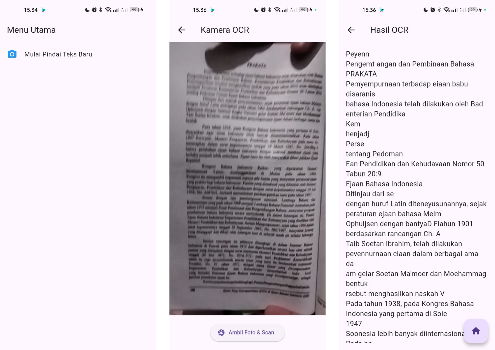
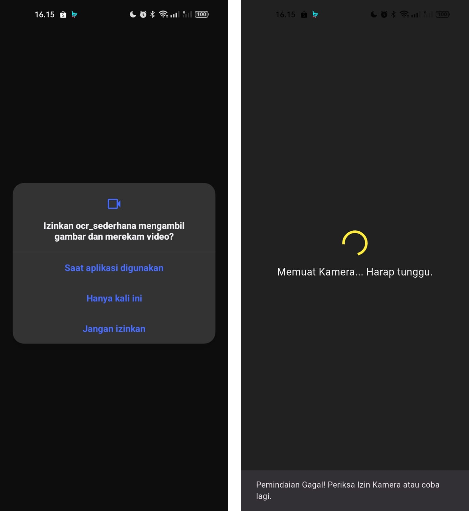

UJIAN TENGAH SEMESTER (UTS) - PRAKTIKUM

Mata Kuliah: Pemrograman Mobile - Aplikasi OCR Semester: Ganjil Tahun Akademik: 2025/2026

## Instruksi Awal (SETUP) - Wajib
1.	Pastikan proyek ocr_sederhana sudah diinisialisasi sebagai repositori Git dan ter- hubung ke akun GitHub Anda.
Github :  https://github.com/rheinaputri/Aplikasi_OCR_Sederhana_Flutter.git

2.	Lakukan commit awal untuk memastikan branch main Anda bersih.

## Soal 1: Modifikasi Struktur Navigasi dan Aliran

**1. Pengubahan Navigasi Home**

**2. Teks Utuh dan Navigasi Balik**

Hasil : 

## Soal 2: Penyesuaian Tampilan dan Penanganan State/Error

**1. Custom Loading Screen di ScanScreen**

Hasil : 

**2. Spesifikasi Pesan Error**

Hasil : 

## Implementasi Plugin Text-to-Speech (TTS)
**1. Instalasi Plugin**
**2. Konversi Widget dan Inisialisasi**
**3. Fungsionalitas Pembacaan**

Hasil :
https://drive.google.com/file/d/1cGy9StUBJuKTP8SxzUKrM68dsN0Q2_Dx/view?usp=sharing

